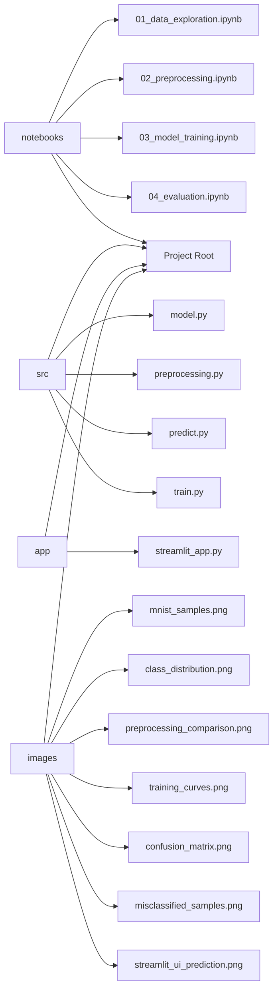
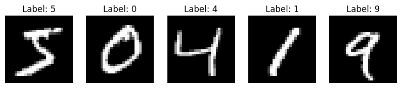
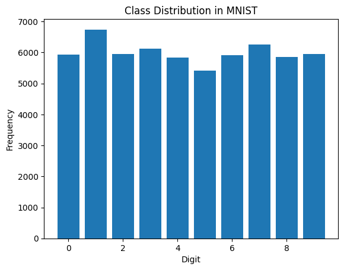
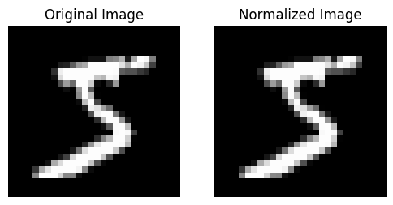
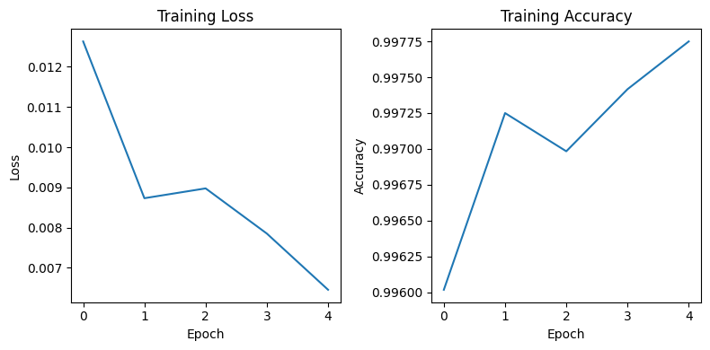
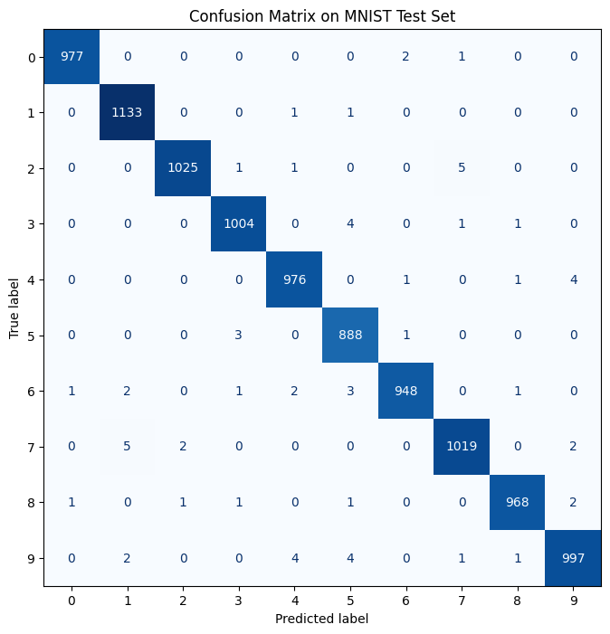
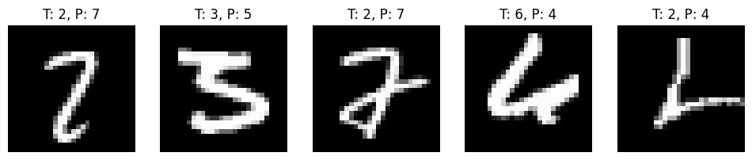
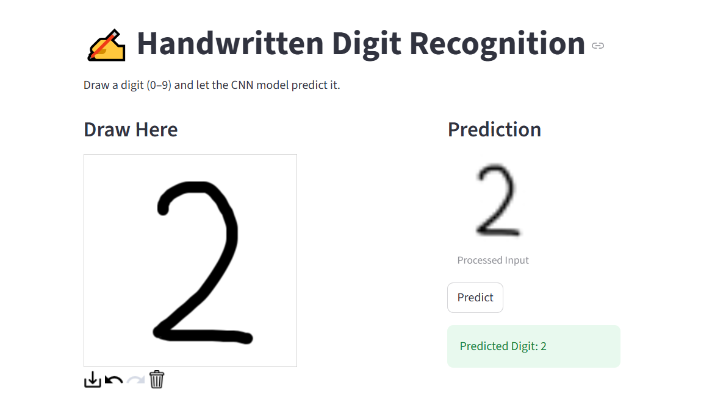

# Handwritten Digit Recognition with CNN

A complete pipeline for **handwritten digit recognition** using PyTorch,  
with preprocessing, CNN model training, evaluation, and a Streamlit demo application.  

The project is **structured professionally** for academic and industrial presentations.

---

## 🗂 Project Structure



---

## 📝 Project Overview

This project demonstrates the full machine learning pipeline:

1. **Data Exploration**
   - Visualize MNIST dataset
   - Check class distribution  
     
   

2. **Data Preprocessing**
   - Convert images to tensors
   - Normalize with MNIST mean & std
   - Ensures training stability  
   

3. **Model Training**
   - CNN architecture with 2 Conv layers + 2 FC layers
   - Trained on MNIST dataset
   - Achieves ~98–99% training accuracy  
   

4. **Model Evaluation**
   - Evaluate on MNIST test set
   - Confusion matrix and misclassified examples  
     
   

5. **Streamlit Demo**
   - Draw a digit on the canvas
   - Predict using the trained CNN
   - UI shows canvas and prediction side by side  
   

---

## 🏗️ Architecture Overview

- **src/**: core ML logic (model, preprocessing, inference, training)
- **notebooks/**: exploration, preprocessing, training, evaluation
- **app/**: Streamlit UI
- **images/**: figures for documentation and README

---

## ⚙️ How to Run

1️⃣ Install Dependencies

Install dependencies using the provided `requirements.txt`.
```bash
pip install -r requirements.txt
```

2️⃣ Train the Model (optional)

Train the model (optional, pre-trained weights are saved in `models/`).
```bash
python src/train.py
```

3️⃣ Run Streamlit App

Run the Streamlit app to test digit predictions.
```bash
streamlit run app/streamlit_app.py
```
---

## 📊 Future Improvements

- Add **data augmentation** to improve generalization
- Experiment with **more complex CNN architectures**
- Add **real-time webcam input** for digit prediction
- Convert to a **full web app with FastAPI + Streamlit frontend**

---

## 📦 requirements.txt

```text
torch==2.7.0
torchvision==0.22.0
numpy>=1.27.0
Pillow>=10.0.0
matplotlib>=3.8.0
scikit-learn>=1.3.0
streamlit>=1.25.0
streamlit-drawable-canvas==0.9.0
pandas>=2.1.0
```
> **Notes**:
> - Version numbers are approximate, compatible with latest stable releases.
> - `streamlit` is needed for the interactive web app.

---

## 🎓 References

- [MNIST Dataset](http://yann.lecun.com/exdb/mnist/)
- PyTorch documentation: https://pytorch.org/
- Streamlit documentation: https://docs.streamlit.io/