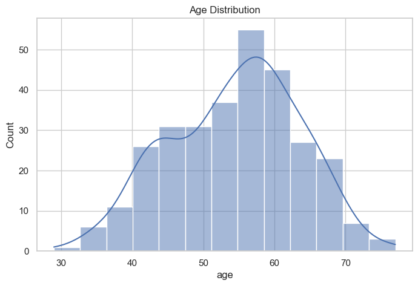
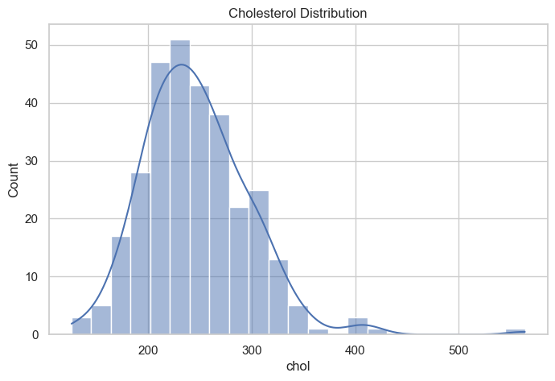
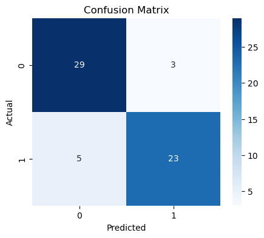
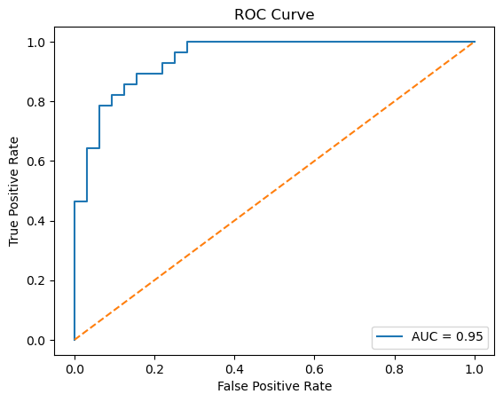

# Heart Disease Prediction

**Heart Disease Prediction** is a machine learning project that predicts the likelihood of heart disease based on the UCI Heart Disease (Cleveland) dataset.  
This project demonstrates the full ML workflow: data exploration, cleaning, modeling, evaluation, and deployment with a Streamlit web application.

---

## 🚀 Project Overview

- **Goal:** Predict heart disease (binary classification) based on patient features.
- **Dataset:** UCI Heart Disease (Cleveland subset) — 303 records, 14 features.
- **ML Models:** Logistic Regression, Random Forest, SVM
- **Best Model:** Random Forest Classifier
- **Deployment:** Interactive Streamlit app

---

## 🗂️ Project Structure

```mermaid
flowchart TD
    A[Project Root] --> B[data]
    A --> C[notebooks]
    A --> D[src]
    A --> E[models]
    A --> F[images]
    
    B --> B1[raw/heart_disease_uci.data]
    B --> B2[processed/cleaned_data.csv]
    
    C --> C1[01_data_exploration.ipynb]
    C --> C2[02_data_cleaning_feature_engineering.ipynb]
    C --> C3[03_model_training_evaluation.ipynb]
    
    D --> D1[app.py]
    D --> D2[preprocess.py]
    D --> D3[config.py]
    
    E --> E1[best_model.pkl]
    
    F --> F1[age_distribution.png]
    F --> F2[chol_distribution.png]
    F --> F3[sex_distribution.png]
    F --> F4[target_distribution.png]
    F --> F5[correlation_heatmap.png]
    F --> F6[confusion_matrix.png]
    F --> F7[roc_curve.png]
```



## 📊 Dataset

- **Source:** [UCI Heart Disease Dataset](https://archive.ics.uci.edu/ml/datasets/heart+disease)  
- **Raw File:** `data/raw/heart_disease_uci.data`  
- **Processed File:** `data/processed/cleaned_data.csv`  

**Features:**

| Feature | Description |
|---------|-------------|
| age | Age in years |
| sex | 1 = Male, 0 = Female |
| cp | Chest pain type (1–4) |
| trestbps | Resting blood pressure |
| chol | Serum cholesterol (mg/dl) |
| fbs | Fasting blood sugar > 120 mg/dl (1 = True, 0 = False) |
| restecg | Resting ECG results (0–2) |
| thalach | Maximum heart rate achieved |
| exang | Exercise induced angina (1 = Yes, 0 = No) |
| oldpeak | ST depression induced by exercise relative to rest |
| slope | Slope of the peak exercise ST segment (1–3) |
| ca | Number of major vessels colored by fluoroscopy (0–3) |
| thal | Thalassemia (3 = Normal, 6 = Fixed Defect, 7 = Reversable Defect) |
| target | 0 = No heart disease, 1 = Heart disease |

---

## 📝 Notebooks

### 1️⃣ 01_data_exploration.ipynb

- Explored dataset structure, missing values, feature distributions.
- Generated visualizations:
    - Age distribution (`images/age_distribution.png`)
    - Cholesterol distribution (`images/chol_distribution.png`)
    - Sex distribution (`images/sex_distribution.png`)
    - Target variable distribution (`images/target_distribution.png`)
    - Correlation heatmap (`images/correlation_heatmap.png`)

### 2️⃣ 02_data_cleaning_feature_engineering.ipynb

- Handled missing values (`?`) by removing affected rows.
- Converted target into binary classification.
- Converted all features to numeric format.
- Saved cleaned dataset: `data/processed/cleaned_data.csv`

### 3️⃣ 03_model_training_evaluation.ipynb

- Trained Logistic Regression, Random Forest, and SVM classifiers.
- Evaluated models using:
    - Accuracy
    - Precision
    - Recall
    - F1-score
    - ROC-AUC
- Selected **Random Forest** as the best model.
- Saved best model: `models/best_model.pkl`
- Visualizations:
    - Confusion Matrix (`images/confusion_matrix.png`)
    - ROC Curve (`images/roc_curve.png`)

---

## 🖥️ Streamlit Web Application

### File: `src/app.py`

- Interactive UI with sidebar inputs for patient information.
- Preprocessing with `src/preprocess.py` and mappings in `src/config.py`.
- Outputs prediction and probability.
- Displays result in color-coded format:
    - 🟢 No Heart Disease
    - 🔴 Heart Disease Detected
- Includes model info and disclaimer.

**Run the app:**

```bash
pip install -r requirements.txt
streamlit run src/app.py
```

---

## 🎨 Screenshots

**Age Distribution:**  


**Cholesterol Distribution:**  


**Confusion Matrix:**  


**ROC Curve:**  


---

## ⚙️ Installation

Clone the repository:

```bash
git clone <repo_url>
cd heart-disease-prediction
```

Create virtual environment (optional but recommended):

```bash
python -m venv venv
source venv/bin/activate  # Linux / Mac
venv\Scripts\activate     # Windows
```

Install dependencies:

```bash
pip install -r requirements.txt
```

---

## 📦 requirements.txt

```text
pandas>=1.5.3  
numpy>=1.25.0  
matplotlib>=3.7.2  
seaborn>=0.12.2  
scikit-learn>=1.3.0  
joblib>=1.3.1  
streamlit>=1.25.0  
```
> **Notes**:
> - Version numbers are approximate, compatible with latest stable releases.
> - `joblib` is required to load saved models.
> - `streamlit` is needed for the interactive web app.

---

## 🧠 Key Features & Highlights

- Complete **ML pipeline**: EDA → Cleaning → Modeling → Deployment
- **Professional documentation** and Markdown explanations in notebooks.
- **Reusable cleaned dataset** for further experiments.
- **Interactive Streamlit app** for demonstration.
- **Visualizations** ready for portfolio showcase.

---

## ⚠️ Disclaimer

This project is **for educational purposes only**.  
It **does not replace medical advice or diagnosis**.  
Do not use it for real medical decision-making.

---

## 📌 References

1. [UCI Heart Disease Dataset](https://archive.ics.uci.edu/dataset/45/heart+disease)  
2. scikit-learn documentation: https://scikit-learn.org/stable/  
3. Streamlit documentation: https://docs.streamlit.io/