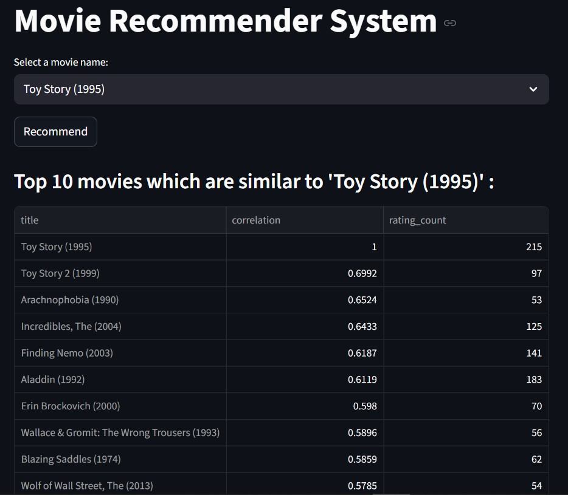

# 🎬 Movie Recommender System (Collaborative Filtering)

A simple yet well-structured **movie recommendation system** built using real-world user ratings data.  
This project demonstrates my understanding of **data exploration**, **data preprocessing**, and **collaborative filtering techniques** commonly used in recommender systems.



---

## 📌 Project Overview

Recommender systems are widely used in industry (e.g., Netflix, Amazon, Spotify).  
In this project, I implemented a **user-based collaborative filtering** approach using movie rating correlations to recommend similar movies.

The focus of this project is:
- Understanding the data
- Building a clean user–item matrix
- Measuring similarity between movies
- Producing interpretable recommendations

---

## 📂 Project Structure
```
movie-recommender/ 
│ ├── data/ 
│     ├── movies.csv 
│     └── ratings.csv 
│ ├── notebooks/ 
│     ├── 01_data_exploration.ipynb 
│     └── 02_build_recommender.ipynb 
│ ├── src/ 
│     ├── app.py (future Streamlit app)
│     └── recommender.py (reusable recommender modules) 
│ ├── README.md 
└──── requirements.txt
```
---

## 📊 Dataset

The dataset consists of:
- **ratings.csv**: user ratings for movies  
- **movies.csv**: movie titles and genres  

### Basic Statistics
- **Users:** 610  
- **Movies:** ~9,700  
- **Ratings:** 100,836  

Each rating includes:
- `userId`
- `movieId`
- `rating`
- `timestamp`

---

## 🔍 Exploratory Data Analysis (EDA)

The notebook `01_data_exploration.ipynb` covers:

- Loading and inspecting the datasets
- Checking data types and missing values
- Merging ratings with movie metadata
- Analyzing:
  - Most rated movies
  - Average movie ratings
  - User and movie distribution

This step ensures a clear understanding of the data before modeling.

---

## 🤖 Recommendation Approach

The recommender is implemented in `02_build_recommender.ipynb` using:

### 🔹 Collaborative Filtering (Item-Based)

Steps:
1. Merge ratings and movies
2. Create a **user–movie rating matrix**
3. Select a target movie
4. Compute **Pearson correlation** between movies
5. Recommend movies with the highest correlation scores

This approach assumes:
> *Users who rated similar movies similarly will enjoy similar content.*

---

## 🧪 Example

If a user likes:
Toy Story (1995)
Copy code

The system finds other movies that show **high rating correlation** with it across users.

---

## 🛠️ Technologies Used

- **Python**
- **Pandas** – data manipulation & analysis
- **Jupyter Notebook** – experimentation & analysis
- **Streamlit** (planned) – interactive UI

---

## 🚀 Future Improvements

Possible extensions to make this system more production-ready:

- Filter out movies with very few ratings
- Normalize ratings to reduce user bias
- Add cosine similarity as an alternative metric
- Implement:
  - User-based collaborative filtering
  - Content-based filtering (genres)
- Deploy an interactive **Streamlit web app**
- Add evaluation metrics (e.g., RMSE)

---

## 📎 Notes

This project is intentionally kept **simple and transparent** to highlight core recommender system concepts rather than relying on black-box libraries.

---

## 👤 Author

**Hamed Rostamkhani**  
Background in software engineering with a growing focus on **Data Science & Machine Learning**.
